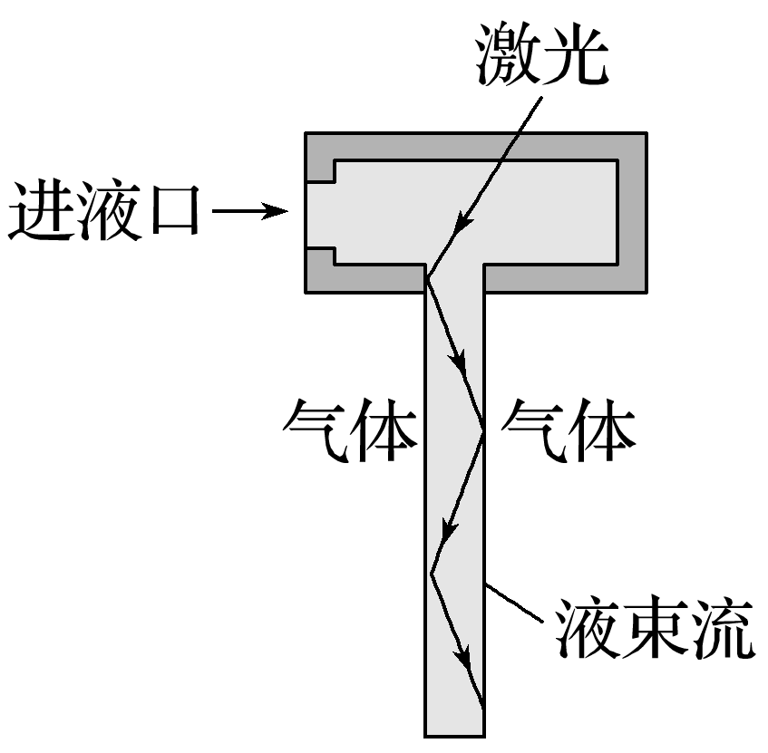
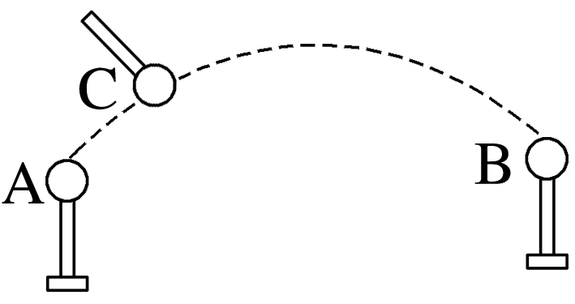
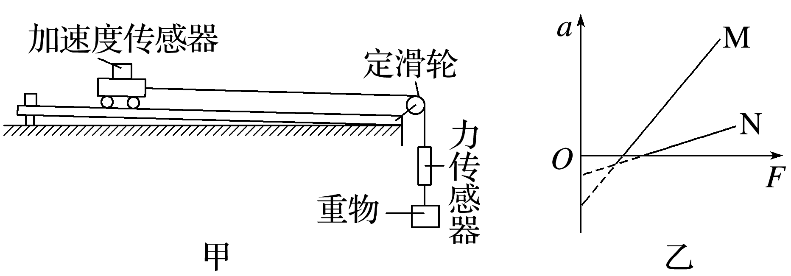
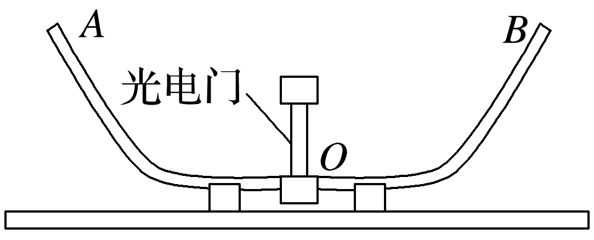
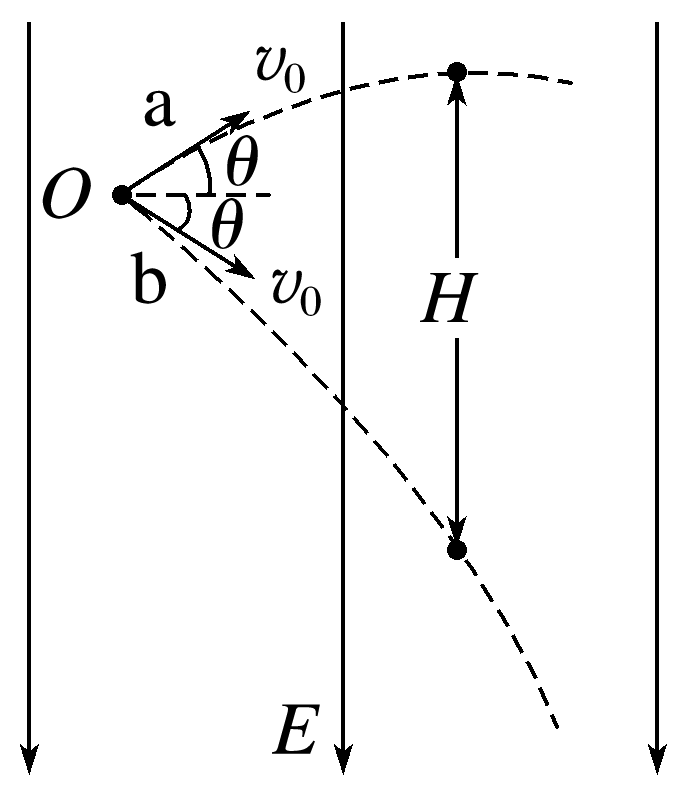
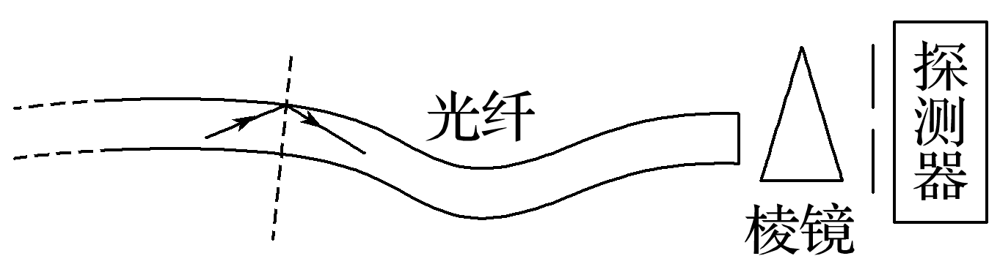

# 连可欣的物理课后巩固练习（40 分钟）

> **学生**：连可欣（高三）　**日期**：2026-09-05　**建议用时**：40 分钟  
> **用途**：日常课后巩固，覆盖高考主干板块（力学/热学/光学/近代物理/电磁学/实验）  
> **组卷来源**：统一题库（2025 年高考真题）9 题，**每题标注原始出处与建议用时**

| 题型 | 题数 | 建议用时 |
|------|------|----------|
| 单选题 | 4 | 12 分钟 |
| 多选题 | 2 | 8 分钟 |
| 实验题 | 1 | 6 分钟 |
| 解答题 | 2 | 14 分钟 |

---

## 一、单项选择题（每题约 3 分钟，共 12 分钟）

### 1.【2025·江苏卷·第1题】（基础·建议 3 分钟）

新能源汽车在辅助驾驶系统测试时，感应到前方有障碍物立刻制动，做匀减速直线运动。2 s内速度由12 m/s减至0。该过程中加速度大小为(　　)

A.2 m/s^2^  
B.4 m/s^2^  
C.6 m/s^2^  
D.8 m/s^2^  

（作答区）

### 2.【2025·河北卷·第2题】（基础·建议 3 分钟）

某同学将一充气皮球遗忘在操场上，找到时发现因太阳曝晒皮球温度升高，体积变大。在此过程中若皮球未漏气，则皮球内封闭气体(　　)

A.对外做功  
B.向外界传递热量  
C.分子的数密度增大  
D.每个分子的速率都增大  

（作答区）

### 3.【2025·云南卷·第1题】（基础·建议 3 分钟）

2025年3月，我国科学家研制的碳14核电池原型机“烛龙一号”发布，标志着我国在核能技术领域与微型核电池领域取得突破。碳14的衰变方程为$^{14}_{6}\mathrm{C}$→$^{14}_{7}\mathrm{N}$＋X，则(　　)

A.X为电子，是在核内中子转化为质子的过程中产生的  
B.X为电子，是在核内质子转化为中子的过程中产生的  
C.X为质子，是由核内中子转化而来的  
D.X为中子，是由核内质子转化而来的  

（作答区）

### 4.【2025·黑吉辽蒙卷·第3题】（中等·建议 3 分钟）

如图，利用液导激光技术加工器件时，激光在液束流与气体界面发生全反射。若分别用甲、乙两种液体形成液束流，甲的折射率比乙的大，则(　　)

A.激光在甲中的频率大  
B.激光在乙中的频率大  
C.用甲时全反射临界角大  
D.用乙时全反射临界角大  

（作答区）

## 二、多项选择题（每题约 4 分钟，共 8 分钟）

### 5.【2025·河北卷·第8题】（中等·建议 4 分钟）

(多选)(2025·河北卷·8)如图，真空中固定在绝缘台上的两个相同的金属小球A和B，带有等量同种电荷，电荷量为q，两者间距远大于小球直径，两者之间的静电力大小为F。用一个电荷量为Q的同样的金属小球C先跟A接触，再跟B接触，移走C后，A和B之间的静电力大小仍为F，则Q∶q的绝对值可能是(　　)

A.1  
B.2  
C.3  
D.5  

（作答区）

### 6.【2025·甘肃卷·第8题】（中等·建议 4 分钟）

(多选)(2025·甘肃卷·8)如图，轻质弹簧上端固定，下端悬挂质量为2m的小球A，质量为m的小球B与A用细线相连，整个系统处于静止状态。弹簧劲度系数为k，重力加速度为g。现剪断细线，下列说法正确的是(　　)

A.小球A运动到弹簧原长处的速度最大  
B.剪断细线的瞬间，小球A的加速度大小为$\frac{g}{2}$  
C.小球A运动到最高点时，弹簧的伸长量为$\frac{mg}{k}$  
D.小球A运动到最低点时，弹簧的伸长量为$\frac{2mg}{k}$  

（作答区）

## 三、实验题（约 6 分钟）

### 7.【2025·广西卷·第12题】（基础·建议 6 分钟）

在用如图甲的装置做“探究加速度与力、质量的关系”实验中：
(1)探究小车加速度与小车所受拉力的关系时，需保持小车(含加速度传感器，下同)质量不变，这种实验方法是　　　　　。
(2)实验时，调节定滑轮高度，使连接小车的细绳与轨道平面保持　　　　　。
(3)由该装置分别探究M、N两车加速度a和所受拉力F的关系，获得a－F图像如图乙，通过图乙分析实验是否需要补偿阻力(即平衡阻力)。如果需要，说明如何操作；如果不需要，说明理由：
。
(4)悬挂重物让M、N两车从静止释放经过相同位移的时间比为n，两车均未到达轨道末端，则两车加速度之比a~M~：a~N~＝　　　　　　。

（作答区）

## 四、解答题（每题约 7 分钟，共 14 分钟）

### 8.【2025·江苏卷·第13题】（中等·建议 7 分钟）

如图所示，在电场强度为E，方向竖直向下的匀强电场中，两个相同的带正电粒子a、b同时从O点以初速度v~0~射出，速度方向与水平方向夹角均为θ。已知粒子的质量为m，电荷量为q，不计重力及粒子间相互作用。求：
(1)a运动到最高点的时间t；
(2)a到达最高点时，a、b间的距离H。

（作答区）

### 9.【2025·黑吉辽蒙卷·第13题】（中等·建议 7 分钟）

如图，一雪块从倾角θ＝37°的屋顶上的O点由静止开始下滑，滑到A点后离开屋顶。O、A间距离x＝2.5 m，A点距地面的高度h＝1.95 m，雪块与屋顶的动摩擦因数μ＝0.125。不计空气阻力，雪块质量不变，取sin 37°＝0.6，重力加速度大小g＝10 m/s^2^。求：
(1)雪块从A点离开屋顶时的速度大小v~0~；
(2)雪块落地时的速度大小v~1~，及其速度方向与水平方向的夹角α。

（作答区）

---

# 答案与解析（完成后对答案用）

### 1.【2025·江苏卷·第1题】 答案：C

- **来源**：2025年高考江苏卷物理真题 第1题（题库 Q-00092）· **难度**：基础 · **考点**：刹车加速度计算

**解析**：根据运动学公式v＝v~0~＋at，代入数值解得a＝－6 m/s^2^，故加速度大小为6 m/s^2^。故选C。

### 2.【2025·河北卷·第2题】 答案：A

- **来源**：2025年高考河北卷物理真题 第2题（题库 Q-00108）· **难度**：基础 · **考点**：皮球曝晒升温（压强体积温度）

**解析**：皮球体积变大，气体膨胀，对外界做功，故A正确；气体温度升高，内能增大，ΔU>0，又因为W<0，根据热力学第一定律知Q>0，气体吸收热量，故B错误；皮球未漏气，分子总数不变，体积变大，分子的数密度减小，故C错误；温度升高，分子平均动能增大，但并非每个分子速率都增大，故D错误。

### 3.【2025·云南卷·第1题】 答案：A

- **来源**：2025年高考云南卷物理真题 第1题（题库 Q-00166）· **难度**：基础 · **考点**：碳14 衰变粒子判断

**解析**：根据质量数守恒和电荷数守恒有$^{14}_{6}\mathrm{C}$→$^{14}_{7}\mathrm{N}$＋$^{0}_{-1}\mathrm{e}$，可知X为电子，是在核内中子转化为质子的过程中产生的。故选A。

### 4.【2025·黑吉辽蒙卷·第3题】 答案：D

- **来源**：2025年高考黑吉辽蒙卷物理真题 第3题（题库 Q-00294）· **难度**：中等 · **考点**：液导激光与折射率

**解析**：激光在不同介质中传播时，其频率不变，故A、B错误；根据sin C＝$\frac{1}{n}$，甲的折射率比乙的大，则用乙时全反射临界角大，故C错误，D正确。

### 5.【2025·河北卷·第8题】 答案：AD

- **来源**：2025年高考河北卷物理真题 第8题（题库 Q-00114）· **难度**：中等 · **考点**：金属球接触电荷再分配

**解析**：C先跟A接触后，两者电荷量均变为q~1~＝$\frac{Q＋q}{2}$，C再跟B接触后，两电荷量均变为q~2~＝$\frac{q＋q_{1}}{2}＝\frac{Q＋3q}{4}$，此时A、B之间静电力大小仍为F＝$\frac{kq^{2}}{L^{2}}$，则有F＝$\frac{kq^{2}}{L^{2}}＝\frac{kq_{1}q_{2}}{L^{2}}$解得Q＝q或Q＝－5q；则Q∶q的绝对值可能是1或者5。故选A、D。

### 6.【2025·甘肃卷·第8题】 答案：BC

- **来源**：2025年高考甘肃卷物理真题 第8题（题库 Q-00269）· **难度**：中等 · **考点**：瞬时加速度分析

**解析**：剪断细线后，弹力大于A的重力，则A先向上做加速运动，随弹力的减小，则向上的加速度减小，当加速度为零时速度最大，此时弹力等于重力，弹簧处于拉伸状态，选项A错误；剪断细线之前F~弹~＝3mg，剪断细线瞬间弹簧弹力不变，则对A由牛顿第二定律F~弹~－2mg＝2ma，解得A的加速度a＝$\frac{g}{2}$，选项B正确；剪断细线之前弹簧伸长量x~1~＝$\frac{3mg}{k}$，剪断细线后A做简谐振动，在平衡位置时弹簧伸长量x~2~＝$\frac{2mg}{k}$，即振幅为A＝x~1~－x~2~＝$\frac{mg}{k}$，由对称性可知小球A运动到最高点时，弹簧伸长量为$\frac{mg}{k}$，选项C正确；由上述分析可知，小球A运动到最低点时，弹簧伸长量为$\frac{3mg}{k}$，选项D错误。

### 7.【2025·广西卷·第12题】 答案：(1)控制变量法(2)平行(3)需要撤除细绳连接的力传感器和重物，将木板左端用垫块垫起适当高度，使小车能沿木板匀速下滑(4)1∶n^2^

- **来源**：2025年高考广西卷物理真题 第12题（题库 Q-00226）· **难度**：基础 · **考点**：控制变量法与图像

**解析**：(1)在探究小车加速度与小车所受拉力的关系时，需保持小车(含加速度传感器)质量不变，这种实验方法是控制变量法。(2)实验时，为使小车运动方向受到细绳的拉力等于力传感器的示数，要调节定滑轮高度，使连接小车的细绳与轨道平面保持平行，保证细绳对小车的拉力方向与小车运动方向一致，减小实验误差。(3)由题图乙可知，当拉力F为某一值时才产生加速度，说明小车受到摩擦力，需要补偿阻力。操作方法：撤除细绳连接的力传感器和重物，将木板左端用垫块垫起适当高度，使小车能沿木板匀速下滑。(4)两车均从静止释放，都做初速度为零的匀加速直线运动，根据匀变速直线运动的位移公式x＝$\frac{1}{2}$at^2^，可知a＝$\frac{2x}{t^{2}}$，因为t~M~∶t~N~＝n∶1，联立解得a~M~∶a~N~＝$t_{N}^{2}$∶$t_{M}^{2}$＝1∶n^2^。

### 8.【2025·江苏卷·第13题】 答案：(1)$\frac{mv_{0}sinθ}{qE}$(2)$\frac{2mv_{0}^{2}sin^{2}θ}{qE}$

- **来源**：2025年高考江苏卷物理真题 第13题（题库 Q-00104）· **难度**：中等 · **考点**：等效重力场中的抛体运动

**解析**：(1)对粒子a根据牛顿第二定律有qE＝maa运动到最高点时，在竖直方向有v~0~sin θ＝at联立解得t＝$\frac{mv_{0}sinθ}{qE}$(2)方法一　根据题意可知，两粒子均在水平方向上做匀速直线运动，且水平方向上的初速度均为v~0~cos θ，则两粒子一直在同一竖直线上，a到达最高点时，a粒子竖直方向上运动的位移为x~1~＝$\frac{(v_{0}sinθ)^{2}}{2a}＝\frac{mv_{0}^{2}sin^{2}θ}{2qE}$b粒子竖直方向上运动位移为x~2~＝v~0~tsin θ$＋\frac{1}{2}$at^2^＝$\frac{3mv_{0}^{2}sin^{2}θ}{2qE}$则粒子a到达最高点时与粒子b之间的距离H＝x~1~＋x~2~＝$\frac{2mv_{0}^{2}sin^{2}θ}{qE}$方法二　两粒子均受到相同静电力，以粒子a为参考系，则粒子b以2v~0~sin θ的速度向下做匀速直线运动，a到达最高点时，a、b间的距离H＝2v~0~sin θ·t＝$\frac{2mv_{0}^{2}sin^{2}θ}{qE}$。

### 9.【2025·黑吉辽蒙卷·第13题】 答案：(1)5 m/s(2)8 m/s60°

- **来源**：2025年高考黑吉辽蒙卷物理真题 第13题（题库 Q-00304）· **难度**：中等 · **考点**：雪块屋顶下滑落地

**解析**：(1)雪块在屋顶上运动过程中，由动能定理得mgxsin θ－μmgcos θ·x＝$\frac{1}{2}$m$v_{0}^{2}$－0代入数据解得v~0~＝5 m/s(2)雪块离开屋顶后，做斜下抛运动，由动能定理得mgh＝$\frac{1}{2}$m$v_{1}^{2}－\frac{1}{2}$m$v_{0}^{2}$代入数据解得v~1~＝8 m/scos α＝$\frac{v_{0}cosθ}{v_{1}}＝\frac{5×0.8}{8}＝\frac{1}{2}$解得α＝60°。
