# 连可欣的物理针对性检测练习

> **学生**：连可欣（高三）　**日期**：2026-09-05　**时长**：约 60 分钟  
> **对应考试**：顺德一中第四届物理运算（平行班）· 2026-09-05  
> **组卷来源**：统一题库（2025 年高考真题）13 题，**每题标注原始出处**

## 薄弱考点诊断

| 错题 | 薄弱考点 | 难度 | 检测题数 |
|------|----------|------|------------|
| 第6题 | 电场功能关系（v-t 图像判电势/场强/电势能） | 较难 | 3 |
| 第7题 | 氢原子能级与光电效应（遏止电压） | 较难 | 4 |
| 第8题 | 电磁感应综合（线框进入磁场） | 难题 | 3 |
| 第10题 | 几何光学（折射率、全反射、光路时间） | 难题 | 3 |

---

## 一、电场功能关系（对应错题：顺德周测第6题）

### 1.【2025·河北卷·第1题】（热身·基础·单选题）

《汉书》记载“姑句家矛端生火”，表明古人很早就发现了尖端放电现象。若带电长矛尖端附近某条电场线如图，则a、b、c、d四点中电势最高的是(　　)

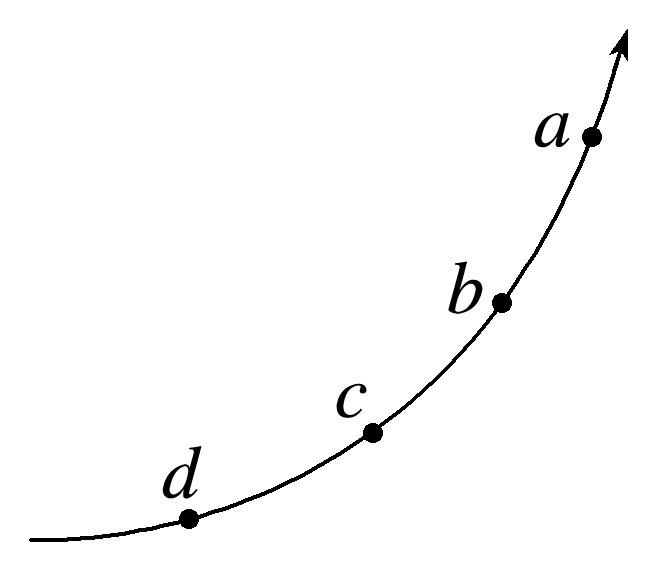

A.a点  
B.b点  
C.c点  
D.d点  

（作答区）

### 2.【2025·河南卷·第4题】（同档检测·中等·单选题）

如图，在与纸面平行的匀强电场中有 $a$、$b$、$c$ 三点，其电势分别为 $6\,\mathrm{V}$、$4\,\mathrm{V}$、$2\,\mathrm{V}$；$a$、$b$、$c$ 分别位于纸面内一等边三角形的顶点上。下列图中箭头表示 $a$ 点电场的方向，则正确的是(　　)

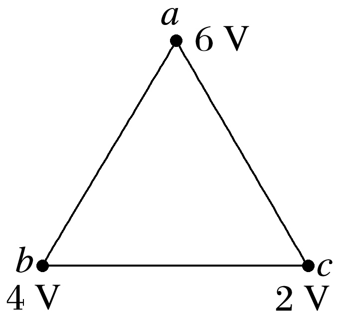

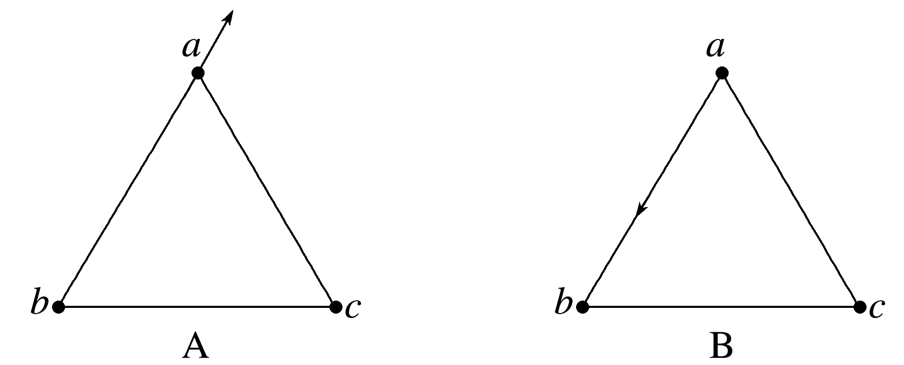

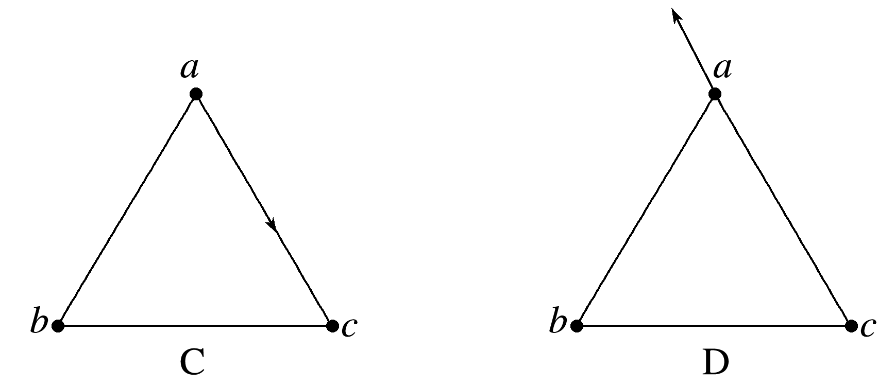

A.见选项图（a 点箭头由 a 指向右上方）  
B.见选项图（a 点箭头沿 ab 方向由 b 指向 a）  
C.见选项图（a 点箭头沿 ac 方向由 a 指向 c）  
D.见选项图（a 点箭头由 a 指向左上方）  

（作答区）

### 3.【2025·云南卷·第4题】（同档检测·中等·单选题）

某介电电泳实验使用非匀强电场，该电场的等势线分布如图所示。a、b、c、d四点分别位于电势为－2 V、－1 V、1 V、2 V的等势线上，则(　　)

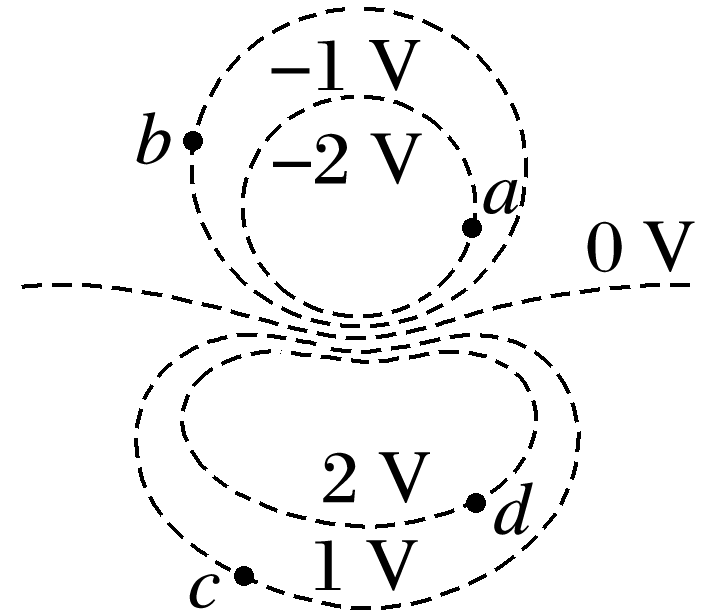

A.a、b、c、d中a点电场强度最小  
B.a、b、c、d中d点电场强度最大  
C.一个电子从b点移动到c点电场力做功为2 eV  
D.一个电子从a点移动到d点电势能增加了4 eV  

（作答区）

## 二、氢原子能级与光电效应（对应错题：顺德周测第7题）

### 4.【2025·广西卷·第1题】（热身·基础·单选题）

有四种不同逸出功的金属材料：铷2.15 eV，钾2.25 eV，钠2.30 eV和镁3.20 eV制成的金属板。现有能量为2.20 eV的光子，分别照到这四种金属板上，则会发生光电效应的金属板为(　　)

A.铷  
B.钾  
C.钠  
D.镁  

（作答区）

### 5.【2025·山东卷·第1题】（同档检测·中等·单选题）

在光电效应实验中，用频率和强度都相同的单色光分别照射编号为1、2、3的金属，所得遏止电压如图所示，关于光电子最大初动能E~k~的大小关系正确的是(　　)

A.E~k1~>E~k2~>E~k3~  
B.E~k2~>E~k3~>E~k1~  
C.E~k3~>E~k2~>E~k1~  
D.E~k3~>E~k1~>E~k2~  

（作答区）

### 6.【2025·浙江卷（6月）·第12题】（同档检测·中等·多选题）

(多选)(2025·浙江6月选考·12)氢原子从n=4、6的能级向n=2的能级跃迁时分别发出光P、Q。则(　　)

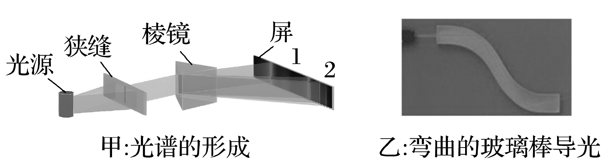

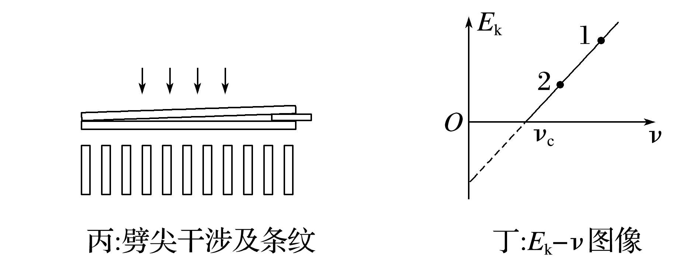

A.P、Q经过甲图装置时屏上谱线分别为2、1  
B.若乙图玻璃棒能导出P光,则一定也能导出Q光  
C.若丙图是P入射时的干涉条纹,则Q入射时条纹间距减小  
D.P、Q照射某金属发生光电效应,丁图中的点1、2分别对应P、Q  

（作答区）

### 7.【2025·江苏卷·第12题】（升档挑战·中等·解答题）

江门中微子实验室使用我国自主研发的光电倍增管，利用光电效应捕捉中微子信息。光电倍增管阴极金属材料的逸出功为W~0~，普朗克常量为h。
(1)求该金属的截止频率ν~0~；
(2)若频率为ν的入射光能使该金属发生光电效应，求光电子的最大初动能E~km~。

（作答区）

## 三、电磁感应综合——线框进磁场（对应错题：顺德周测第8题）

### 8.【2025·陕晋宁青卷·第7题】（同档检测·较难·单选题）

如图，光滑水平面上存在竖直向上、宽度d大于2L的匀强磁场，其磁感应强度大小为B。甲、乙两个合金导线框的质量均为m，长均为2L，宽均为L，电阻分别为R和2R。两线框在光滑水平面上以相同初速度v~0~＝$\frac{4B^{2}L^{3}}{mR}$并排进入磁场，忽略两线框之间的相互作用。则(　　)

A.甲线框进磁场和出磁场的过程中电流方向相同  
B.甲、乙线框刚进磁场区域时，所受合力大小之比为1∶1  
C.乙线框恰好完全出磁场区域时，速度大小为0  
D.甲、乙线框从刚进磁场区域到完全出磁场区域产生的焦耳热之比为4∶3  

（作答区）

### 9.【2025·黑吉辽蒙卷·第9题】（同档检测·较难·多选题）

(多选)(2025·黑吉辽蒙卷·9)如图，“”形导线框置于磁感应强度大小为B、方向水平向右的匀强磁场中。线框相邻两边均互相垂直，各边长均为l。线框绕b、e所在直线以角速度ω顺时针匀速转动，be与磁场方向垂直。t＝0时，abef与水平面平行，则(　　)

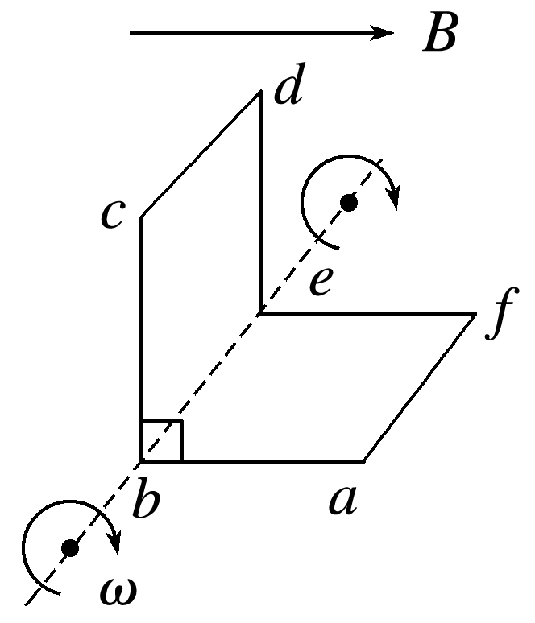

A.t＝0时，电流方向为abcdefa  
B.t＝0时，感应电动势为Bl^2^ω  
C.t＝$\frac{π}{ω}$时，感应电动势为0  
D.t＝0到t＝$\frac{π}{ω}$过程中，感应电动势平均值为0  

（作答区）

### 10.【2025·云南卷·第15题】（升档挑战·难题·解答题）

如图所示，光滑水平面上有一个长为L、宽为d的长方体空绝缘箱，其四周紧固一电阻为R的水平矩形导线框，箱子与导线框的总质量为M。与箱子右侧壁平行的磁场边界平面如截面图中虚线PQ所示，边界右侧存在范围足够大的匀强磁场，其磁感应强度大小为B、方向竖直向下。t＝0时刻，箱子在水平向右的恒力F(大小未知)作用下由静止开始做匀加速直线运动，这时箱子左侧壁上距离箱底h处、质量为m的木块(视为质点)恰好能与箱子保持相对静止。箱子右侧壁进入磁场瞬间，木块与箱子分离；箱子完全进入磁场前某时刻，木块落到箱子底部，且箱子与木块均不反弹(木块下落过程中与箱子侧壁无碰撞)；木块落到箱子底部时即撤去F。运动过程中，箱子右侧壁始终与磁场边界平行，忽略箱壁厚度、箱子形变、导线粗细及空气阻力。木块与箱子内壁间的动摩擦因数为μ，假设最大静摩擦力等于滑动摩擦力，重力加速度为g。
(1)求F的大小；
(2)求t＝0时刻，箱子右侧壁距磁场边界的最小距离；
(3)若t＝0时刻，箱子右侧壁距磁场边界的距离为s(s大于(2)问中最小距离)，求最终木块与箱子的速度大小。

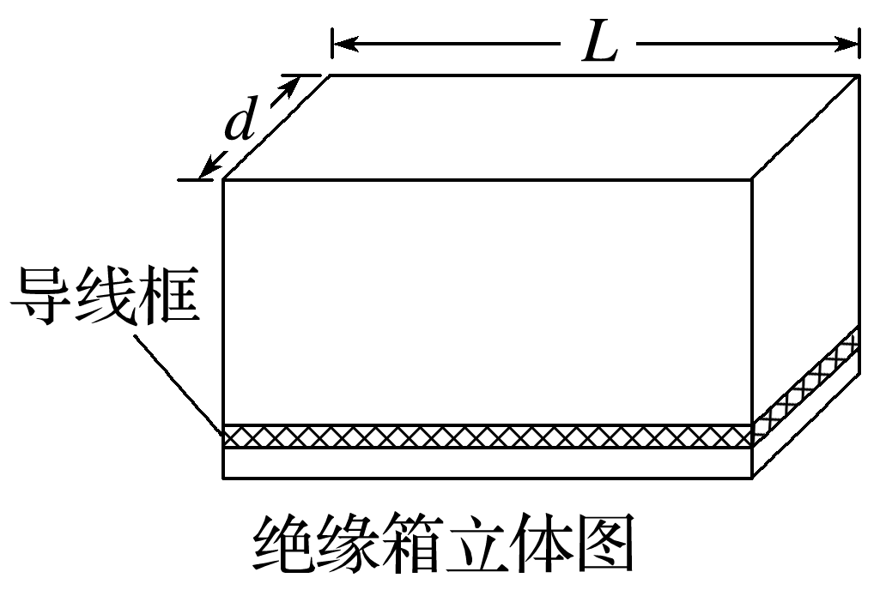

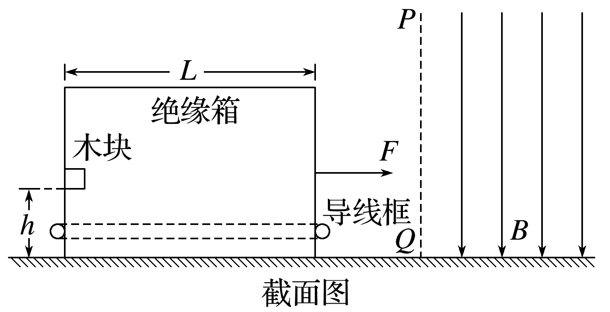

（作答区）

## 四、几何光学——折射与全反射（对应错题：顺德周测第10题）

### 11.【2025·河南卷·第2题】（热身·中等·单选题）

折射率为 $\sqrt{2}$ 的玻璃圆柱水平放置，平行于其横截面的一束光线从顶点入射，光线与竖直方向的夹角为 $45°$，如图所示。该光线从圆柱内射出时，与竖直方向的夹角为(不考虑光线在圆柱内的反射)(　　)

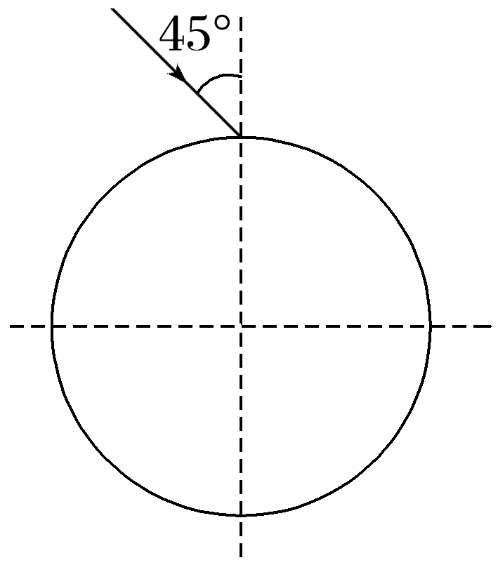

A.0°  
B.15°  
C.30°  
D.45°  

（作答区）

### 12.【2025·河北卷·第13题】（同档检测·中等·解答题）

光纤光谱仪的部分工作原理如图所示。待测光在光纤内经多次全反射从另一端射出，再经棱镜偏转，然后通过狭缝进入光电探测器。
(1)若将光纤简化为真空中的长玻璃丝，设玻璃丝的折射率为$\frac{2\sqrt{3}}{3}$，求光在玻璃丝内发生全反射时的最小入射角。
(2)若探测器阴极材料的逸出功为9.939×10^－^^20^ J，求该材料的截止频率(普朗克常量h＝6.626×10^－^^34^ J·s)。

（作答区）

### 13.【2025·山东卷·第15题】（升档挑战·难题·解答题）

由透明介质制作的光学功能器件截面如图所示，器件下表面圆弧以O点为圆心，上表面圆弧以O'点为圆心，两圆弧的半径及O、O'两点间距离均为R，点A、B、C在下表面圆弧上。左界面AF和右界面CH与OO'平行，到OO'的距离均为$\frac{9}{10}$R。
(1)B点与OO'的距离为$\frac{\sqrt{3}}{2}$R，单色光线从B点平行于OO'射入介质，射出后恰好经过O'点，求介质对该单色光的折射率n；
(2)若该单色光线从G点沿GE方向垂直AF射入介质，并垂直CH射出，出射点在GE的延长线上，E点在OO'上，O'、E两点间的距离为$\frac{\sqrt{2}}{2}$R，空气中的光速为c，求该光在介质中的传播时间t。

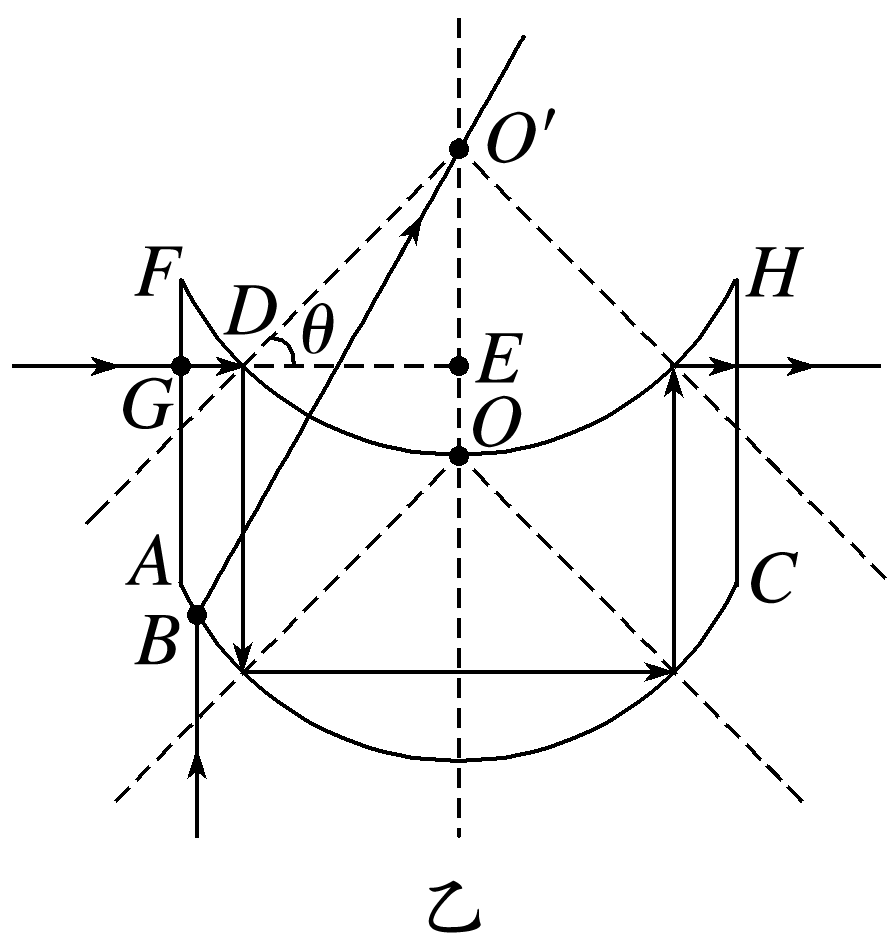

（作答区）

---

# 答案与解析（教师批改后讲解用）

### 1.【2025·河北卷·第1题】 答案：D

- **来源**：2025年高考河北卷物理真题 第1题（题库 Q-00107）
- **对应错题**：顺德周测 2026-09-05 · **难度**：基础 · **考点**：尖端放电电场线电势比较

**解析**：根据电场线的性质：沿电场线方向电势逐渐降低。因此电势最高的是d点。故选D。

### 2.【2025·河南卷·第4题】 答案：C

- **来源**：2025年高考河南卷物理真题 第4题（题库 Q-00029）
- **对应错题**：顺德周测 2026-09-05 · **难度**：中等 · **考点**：电势、等势面、电场线与电势关系

**解析**：ac 中点 d 电势 $\varphi_d=(6+2)/2=4\,\mathrm{V}=\varphi_b$，故 bd 连线为等势面。电场线垂直等势面且由高电势指向低电势，即沿 ac 由 a 指向 c。选 C。

### 3.【2025·云南卷·第4题】 答案：C

- **来源**：2025年高考云南卷物理真题 第4题（题库 Q-00169）
- **对应错题**：顺德周测 2026-09-05 · **难度**：中等 · **考点**：非匀强电场等势线疏密

**解析**：根据等势面越密集处电场强度越大，可知a、b、c、d中a点电场强度最大，故A、B错误；一个电子从b点移动到c点电场力做功为W~bc~＝－eU~bc~＝2 eV，故C正确；一个电子从a点移动到d点电场力做功为W~ad~＝－eU~ad~＝4 eV，由于电场力做正功，电势能减小，则一个电子从a点移动到d点电势能减小了4 eV，故D错误。

### 4.【2025·广西卷·第1题】 答案：A

- **来源**：2025年高考广西卷物理真题 第1题（题库 Q-00215）
- **对应错题**：顺德周测 2026-09-05 · **难度**：基础 · **考点**：逸出功与光子能量比较

**解析**：当光子的能量大于金属的逸出功时就能发生光电效应，可知能量为2.20 eV的光子分别照射到四种金属板上，会发生光电效应的金属板是铷。故选A。

### 5.【2025·山东卷·第1题】 答案：B

- **来源**：2025年高考山东卷物理真题 第1题（题库 Q-00059）
- **对应错题**：顺德周测 2026-09-05 · **难度**：中等 · **考点**：遏止电压与光电子最大初动能

**解析**：根据光电子最大初动能与遏止电压的关系E~k~＝eU~c~，根据图像有U~c2~>U~c3~>U~c1~，故E~k2~>E~k3~>E~k1~，故选B。

### 6.【2025·浙江卷（6月）·第12题】 答案：BC

- **来源**：2025年高考浙江卷（6月）物理真题 第12题（题库 Q-00241）
- **对应错题**：顺德周测 2026-09-05 · **难度**：中等 · **考点**：能级差与光子频率

**解析**：氢原子从n=4、6的能级向n=2的能级跃迁时分别发出P、Q光,则P光对应的光子能量较小,光子的频率较小,P光的折射率较小,则经过甲图装置时P光的偏折程度较小,则P、Q在屏上谱线分别为1、2,A错误;根据sin C=$\frac{1}{n}$可知,P光折射率较小,则发生全反射的临界角较大,若乙图玻璃棒能导出P光,则一定也能导出Q光,B正确;若丙图是P光入射时的干涉条纹,因P光波长大于Q光,则Q光入射时条纹间距减小,C正确;P光频率小于Q光,根据E~k~=hν-W~逸出功~,可知丁图中的点1、2分别对应Q、P,D错误。

### 7.【2025·江苏卷·第12题】 答案：(1)$\frac{W_{0}}{h}$(2)hν－W~0~

- **来源**：2025年高考江苏卷物理真题 第12题（题库 Q-00103）
- **对应错题**：顺德周测 2026-09-05 · **难度**：中等 · **考点**：截止频率与最大初动能

**解析**：(1)根据题意，由光电效应方程有E~k~＝hν~0~－W~0~当E~k~＝0时，可得该金属的截止频率ν~0~＝$\frac{W_{0}}{h}$(2)根据题意，由光电效应方程可得，光电子的最大初动能为E~km~＝hν－W~0~。

### 8.【2025·陕晋宁青卷·第7题】 答案：D

- **来源**：2025年高考陕晋宁青卷物理真题 第7题（题库 Q-00157）
- **对应错题**：顺德周测 2026-09-05 · **难度**：较难 · **考点**：两线框先后进磁场减速

**解析**：根据楞次定律，甲线框进磁场的过程电流方向为顺时针，出磁场的过程中电流方向为逆时针，故A错误；甲线框刚进磁场区域时，合力为F~安~~1~＝BI~1~L＝B·$\frac{BLv_{0}}{R}$L＝$\frac{B^{2}L^{2}v_{0}}{R}$，乙线框刚进磁场区域时，合力为F~安~~2~＝BI~2~L＝B·$\frac{BLv_{0}}{2R}$L＝$\frac{B^{2}L^{2}v_{0}}{2R}$，可得$\frac{F_{安1}}{F_{安2}}$＝2，故B错误；假设甲、乙都能完全出磁场，对甲根据动量定理－B$I_{1}$LΔt＝mv~1~－mv~0~，q~1~＝$I_{1}$Δt＝$\frac{\frac{ΔΦ}{Δt}}{R}$·Δt＝$\frac{ΔΦ}{R}＝\frac{B·4L^{2}}{R}$，同理对乙－B$I_{2}$LΔt'＝mv~2~－mv~0~，q~2~＝$I_{2}$Δt'＝$\frac{\frac{ΔΦ}{Δt'}}{2R}$·Δt'＝$\frac{ΔΦ}{2R}＝\frac{B·4L^{2}}{2R}$，解得v~1~＝0，v~2~＝$\frac{1}{2}$v~0~＝$\frac{2B^{2}L^{3}}{mR}$，故甲恰好完全出磁场区域，乙完全出磁场区域时，速度大小不为0，故C错误；由能量守恒可知甲、乙线框从刚进磁场区域到完全出磁场区域产生的焦耳热分别为Q~1~＝$\frac{1}{2}$mv~0~^2^，Q~2~＝$\frac{1}{2}$mv~0~^2^－$\frac{1}{2}$m$\frac{v_{0}}{2}^{2}＝\frac{3}{8}$mv~0~^2^，可得$\frac{Q_{1}}{Q_{2}}＝\frac{4}{3}$，故D正确。

### 9.【2025·黑吉辽蒙卷·第9题】 答案：AB

- **来源**：2025年高考黑吉辽蒙卷物理真题 第9题（题库 Q-00300）
- **对应错题**：顺德周测 2026-09-05 · **难度**：较难 · **考点**：U 形线框磁场中转动

**解析**：线框转动时，切割磁感线产生电动势的两条边为cd和af，t＝0时刻cd边速度与磁场方向平行，不产生感应电动势，此时af边切割磁感线产生感应电动势，由右手定则可知电流方向为abcdefa，感应电动势为E＝Blv＝Blωl＝Bl^2^ω，A、B正确；t＝$\frac{π}{ω}$时，线框旋转180°，此时依旧是af边切割磁感线产生感应电动势，感应电动势不为零，C错误；t＝0到t＝$\frac{π}{ω}$的过程中，线框abef的磁通量变化量为零，线框bcde的磁通量变化量大小为|ΔΦ|＝2BS＝2Bl^2^，由法拉第电磁感应定律可得平均感应电动势为$E＝\frac{|ΔΦ}{Δt}＝\frac{2Bωl^{2}}{π}$，D错误。

### 10.【2025·云南卷·第15题】 答案：(1)$\frac{(M＋m)g}{μ}$(2)$\frac{(M＋m)^{2}gR^{2}}{2μB^{4}d^{4}}$(3)$\frac{g}{μ}(\sqrt{\frac{2μs}{g}}＋\sqrt{\frac{2h}{g}}$)－$\frac{B^{2}d^{2}L}{(M＋m)R}$

- **来源**：2025年高考云南卷物理真题 第15题（题库 Q-00180）
- **对应错题**：顺德周测 2026-09-05 · **难度**：难题 · **考点**：绝缘箱导线框进磁场（动量守恒）

**解析**：(1)对木块与箱子整体受力分析，由牛顿第二定律F＝(M＋m)a对木块受力分析，水平方向由牛顿第二定律F~N~＝ma竖直方向由平衡条件mg＝F~f~＝μF~N~联立解得F＝$\frac{(M＋m)g}{μ}$(2)设箱子刚进入磁场中时速度大小为v，产生的感应电动势为E＝Bdv由闭合电路欧姆定律得，感应电流为I＝$\frac{E}{R}$安培力大小为F~安~＝BId联立解得F~安~＝$\frac{B^{2}d^{2}v}{R}$若要使木块与箱子分离，F~N~＝0，此时有F~安~≥F其中F＝$\frac{(M＋m)g}{μ}$解得v≥$\frac{(M＋m)gR}{μB^{2}d^{2}}$设箱子右侧壁距磁场边界的距离为s，由运动学公式v^2^＝2as解得s≥$\frac{(M＋m)^{2}gR^{2}}{2μB^{4}d^{4}}$故t＝0时刻，箱子右侧壁距磁场边界的最小距离为s~min~＝$\frac{(M＋m)^{2}gR^{2}}{2μB^{4}d^{4}}$(3)设木块做匀加速直线运动的时间为t~1~，水平方向由运动学公式s＝$\frac{1}{2}$a$t_{1}^{2}$设从木块与箱子分离到木块落到箱子底部的时间为t~2~，此过程木块做平抛运动，竖直方向有h＝$\frac{1}{2}$g$t_{2}^{2}$F＝$\frac{(M＋m)g}{μ}$＝(M＋m)a可得力F作用的总时间为t＝t~1~＋t~2~＝$\sqrt{\frac{2μs}{g}}＋\sqrt{\frac{2h}{g}}$水平方向对系统由动量定理，有Ft－F~安~t~2~'＝(M＋m)v－0，其中F~安~t~2~'＝$\frac{B^{2}d^{2}L}{R}$联立解得v＝$\frac{g}{μ}(\sqrt{\frac{2μs}{g}}＋\sqrt{\frac{2h}{g}}$)－$\frac{B^{2}d^{2}L}{(M＋m)R}$。

### 11.【2025·河南卷·第2题】 答案：B

- **来源**：2025年高考河南卷物理真题 第2题（题库 Q-00027）
- **对应错题**：顺德周测 2026-09-05 · **难度**：中等 · **考点**：折射率、折射定律、几何光学（圆柱面入射出射）

**解析**：入射时由折射定律 $\sqrt{2}=\sin 45°/\sin\theta$，得 $\theta=30°$。由几何关系，出射时入射角 $i=\theta=30°$，法线与竖直方向夹角 $\alpha=60°$，由折射定律 $\sqrt{2}=\sin r/\sin 30°$ 得 $\sin r=\sqrt{2}/2$，$r=45°$，与竖直方向夹角 $\beta=\alpha-r=15°$。选 B。

### 12.【2025·河北卷·第13题】 答案：(1)60°(2)1.5×10^14^ Hz

- **来源**：2025年高考河北卷物理真题 第13题（题库 Q-00119）
- **对应错题**：顺德周测 2026-09-05 · **难度**：中等 · **考点**：光纤与棱镜光路（折射+全反射）

**解析**：(1)光在玻璃丝内发生全反射的最小入射角满足sin C＝$\frac{1}{n}$可得C＝60°(2)根据爱因斯坦光电效应方程hν~0~＝W~0~可得ν~0~＝1.5×10^14^ Hz。

### 13.【2025·山东卷·第15题】 答案：(1)$\sqrt{3}$(2)$\frac{19\sqrt{3}R}{5c}$

- **来源**：2025年高考山东卷物理真题 第15题（题库 Q-00073）
- **对应错题**：顺德周测 2026-09-05 · **难度**：难题 · **考点**：复合圆弧光学器件（折射+全反射）

**解析**：(1)如图甲所示，根据题意可知B点与OO'的距离为$\frac{\sqrt{3}}{2}$R，OB＝R，所以sin θ~1~＝$\frac{\frac{\sqrt{3}}{2}R}{R}＝\frac{\sqrt{3}}{2}$可得θ~1~＝60°又因为射出后恰好经过O'点，O'点为该光学器件上表面圆弧的圆心，则该单色光从B点沿直线BO'射到O'点；因为OB＝OO'＝R，所以根据几何关系可知θ~2~＝30°介质对该单色光的折射率n＝$\frac{sin θ_{1}}{sin θ_{2}}＝\frac{sin60°}{sin30°}＝\sqrt{3}$(2)若该单色光线从G点沿GE方向垂直AF射入介质，第一次射出介质的点为D，且O'E＝$\frac{\sqrt{2}}{2}$R，可知sin θ＝$\frac{\frac{\sqrt{2}}{2}R}{R}＝\frac{\sqrt{2}}{2}$由于sin θ＝$\frac{\sqrt{2}}{2}$>sin C＝$\frac{1}{n}＝\frac{\sqrt{3}}{3}$所以光线在上表面D点发生全反射，轨迹如图乙根据几何关系可知光在介质中传播的距离为L＝2(GE＋AF)＝$\frac{19}{5}$R光在介质中传播的速度为v＝$\frac{c}{n}＝\frac{\sqrt{3}c}{3}$所以光在介质中的传播时间t＝$\frac{L}{v}＝\frac{\frac{19}{5}R}{\frac{\sqrt{3}c}{3}}＝\frac{19\sqrt{3}R}{5c}$。
