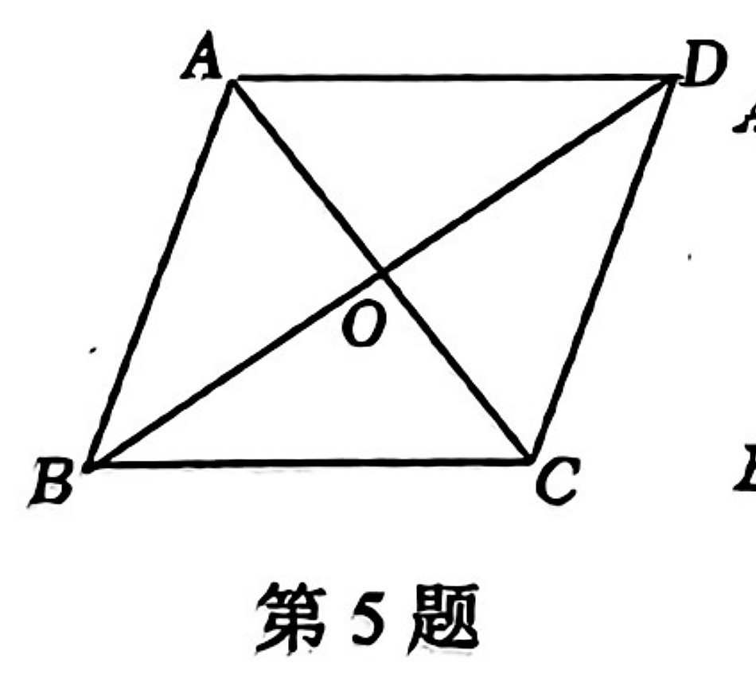
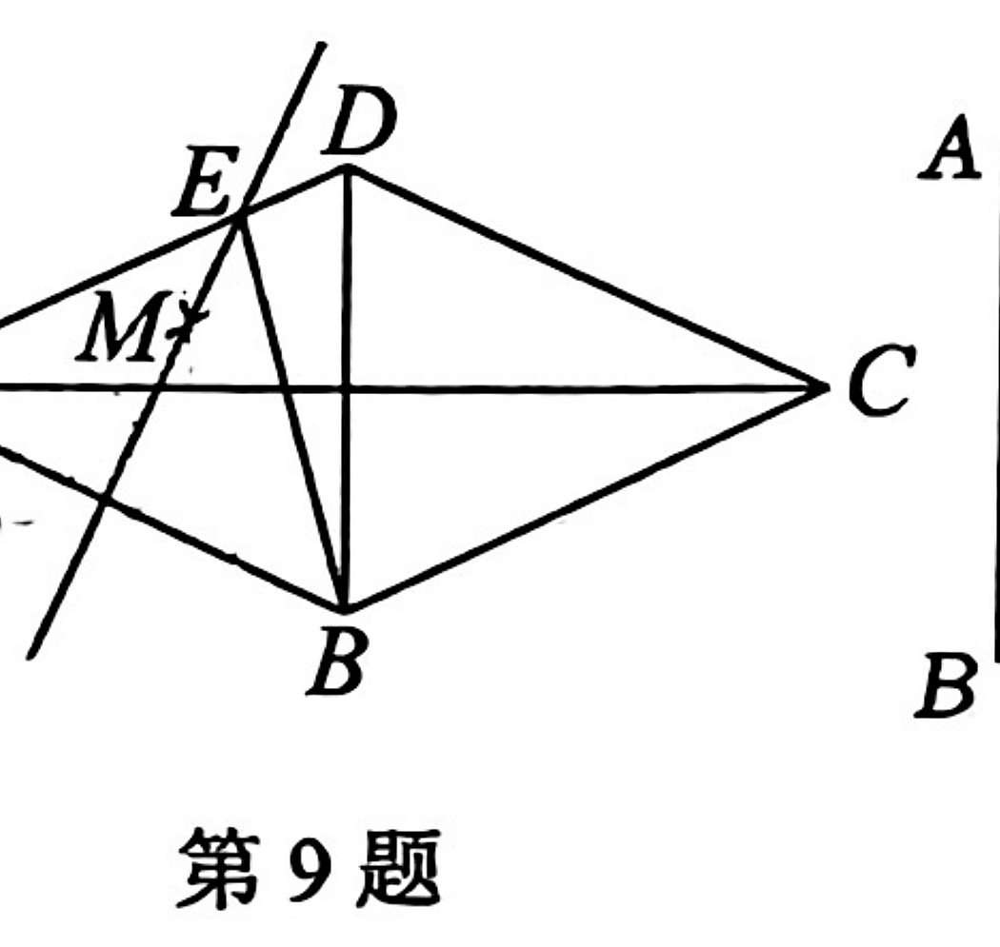
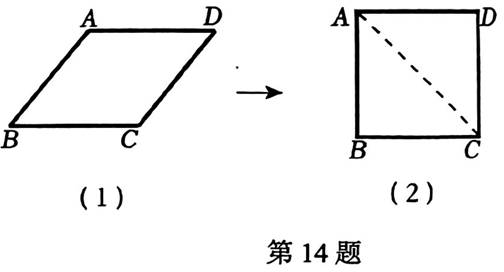
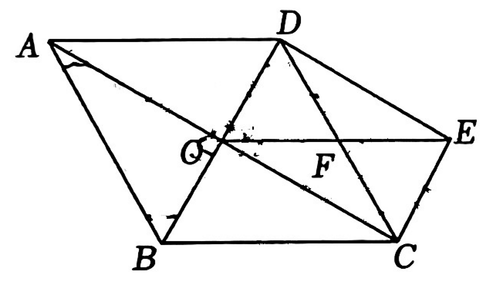
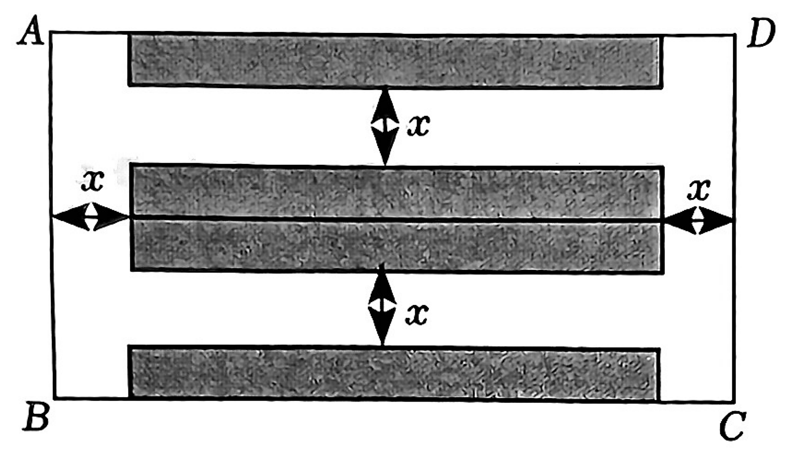

# 吴天豪的数学阶段诊断练习（1小时）

> **学生**：吴天豪（初三）　**日期**：2026-09-06　**总时长**：60 分钟  
> **范围**：特殊平行四边形、一元二次方程及相关计算基础；避开未系统学习的函数、圆、相似、三角函数。  
> **训练重点**：独立限时稳定性、计算防错、方程建模、几何证明书写。

## 出卷意图

- 依据吴天豪近期两次单元检测首测约77、79分，评讲后二刷提升到110分以上的特点，本卷不以“讲新题”为主，而是检测其独立限时状态下的稳定输出能力。
- 选题围绕当前已学内容：特殊平行四边形与一元二次方程，同时穿插计算、配方、判别式、根与系数关系、方程应用和几何证明，避开函数、圆、相似、三角函数等未系统学习内容。
- 难度采用“基础保分 + 中档稳定 + 两道压轴前置”的结构，观察他是否能把听懂后的方法迁移到陌生题，并重点暴露计算准确性、审题建模和几何证明书写规范问题。
- 建议批改时不只看答案，重点标记：计算错、条件漏读、方程建模错、证明理由不完整、二次方程检验/范围意识不足。

## 试卷结构

| 题型 | 题数 | 目标 |
|---|---:|---|
| 单选题 | 6 | 快速识别概念、性质与模型 |
| 填空题 | 5 | 检测计算准确性与关键结论调用 |
| 解答题 | 4 | 检测过程书写、解方程、证明与建模 |

---
## 学生作答区

## 一、选择题

### 1.【九上第一次核心素养监测·第1题｜基础】

下列方程中，一定是一元二次方程的是（ ）

A.$2x^2-\frac{3}{x}+1=0$  
B.$y-2x=0$  
C.$5x^2-1=0$  
D.$ax^2+bx+c=0$（$a,b,c$为常数）  

答：__________

### 2.【九上第一次核心素养监测·第4题｜基础】

已知一元二次方程的两根分别为$x_1=3$，$x_2=-4$，则这个方程为（ ）

A.$(x+3)(x-4)=0$  
B.$(x-3)(x+4)=0$  
C.$(x+3)(x+4)=0$  
D.$(x-3)(x-4)=0$  

答：__________

### 3.【九上第一次核心素养监测·第5题｜基础】

如图，在菱形$ABCD$中，对角线$AC$、$BD$的长分别为$8\text{ cm}$、$6\text{ cm}$，则这个菱形的周长为（ ）

A.$10\text{ cm}$  
B.$14\text{ cm}$  
C.$20\text{ cm}$  
D.$28\text{ cm}$  

答：__________

### 4.【九上第一次核心素养监测·第7题｜中等】

若关于$x$的一元二次方程$(k-1)x^2-x+\frac14=0$有实数根，则实数$k$的取值范围是（ ）

A.$k<2$  
B.$k<2$且$k\ne1$  
C.$k\le2$  
D.$k\le2$且$k\ne1$  

答：__________

### 5.【九上第一次核心素养监测·第8题｜基础】

某件羽绒服原价360元，店长需要清空库存，对该件羽绒服进行了连续两次降价，现在售价为200元。设平均每次降价的百分率为$x$，则下面所列方程正确的是（ ）

A.$360(1+x)^2=200$  
B.$360(1-x)^2=200$  
C.$200(1+x)^2=360$  
D.$200(1-x)^2=360$  

答：__________

### 6.【九上第一次核心素养监测·第9题｜中等】

如图，在菱形$ABCD$中，$\angle DAB=50^\circ$，分别以点$A$、$B$为圆心，大于$\frac12AB$的长为半径作弧相交于$M$、$N$两点，过$M$、$N$两点的直线交$AD$边于点$E$（作图痕迹如图所示），连接$BE$、$BD$，则$\angle EBC$的度数为（ ）

A.$50^\circ$  
B.$60^\circ$  
C.$70^\circ$  
D.$80^\circ$  

答：__________

## 二、填空题

### 7.【九上第一次核心素养监测·第11题｜基础】

方程$x^2=x$的根为________。

答：__________

### 8.【九上第一次核心素养监测·第12题｜基础】

用配方法解方程$x^2-4x+7=0$时，可将方程变为$(x-m)^2=n$的形式，则$mn$的值为________。

答：__________

### 9.【九上第一次核心素养监测·第14题｜中等】

小明用四根长度相等的木条制作了能够活动的菱形学具，他先活动学具成为图（1）所示的菱形，并测得$\angle B=60^\circ$，接着活动学具成为图（2）所示的正方形，并测得对角线$AC=10\sqrt2$，则图（1）中菱形的对角线$BD$长为________。

答：__________

### 10.【第二章单元测试·第13题｜中等】

已知$x=-1$是方程$x^2-ax+6=0$的一个根，则$a=$________，另一个根为________。

答：__________

### 11.【第二章单元测试·第15题｜中等】

设$m$、$n$是一元二次方程$x^2+3x-7=0$的两个根，则$m^2+4m+n=$________。

答：__________

## 三、解答题

### 12.【九上第一次核心素养监测·第16题｜基础】

解方程：
（1）$(x+3)^2-25=0$；
（2）$2x^2+4x+1=0$。

（请写出完整过程）

答：

### 13.【第二章单元测试·第16题｜中等】

用适当的方法解方程：
（1）$x^2-5x+1=0$
（2）$(3x-2)^2=(2x-3)^2$
（3）$x^2-4x-1=0$
（4）$3(x-2)^2=x^2-4$

（请写出完整过程）

答：

### 14.【九上第一次核心素养监测·第18题｜中等】

如图，菱形$ABCD$中，对角线$AC$、$BD$交于点$O$，点$F$是$CD$的中点，延长$OF$到点$E$，使$EF=OF$，连接$CE$、$DE$。
（1）求证：四边形$DOCE$是矩形；
（2）若$OE=2$，$\angle ABC=120^\circ$，求菱形$ABCD$的面积。

（请写出完整过程）

答：

### 15.【九上第一次核心素养监测·第20题｜中等】

社区利用一块矩形空地$ABCD$建了一个小型停车场，其布局如图所示。已知$AD=52\text{ m}$，$AB=28\text{ m}$，阴影部分设计为停车位，要铺花砖，其余部分均为宽度为$x$米的道路。已知铺花砖的面积为$640\text{ m}^2$。
（1）求道路的宽是多少米？
（2）该停车场共有车位50个，据调查分析，当每个车位的月租金为200元时，可全部租出；若每个车位的月租金每上涨5元，就会少租出1个车位。当每个车位的月租金上涨多少元时，停车场的月租金收入为10125元？

（请写出完整过程）

答：

---
# 答案与解析（教师/完成后使用）

### 1.【2024学年第一学期九年级第一次学科核心素养监测 数学试卷·第1题】 答案：C

- **难度**：基础
- **知识点**：一元二次方程
- **考点**：一元二次方程的定义

**解析**：一元二次方程必须是整式方程，且整理后二次项系数不为0，只有C符合。

### 2.【2024学年第一学期九年级第一次学科核心素养监测 数学试卷·第4题】 答案：B

- **难度**：基础
- **知识点**：一元二次方程
- **考点**：由根写方程

**解析**：根为3和-4，对应方程为$(x-3)(x+4)=0$。

### 3.【2024学年第一学期九年级第一次学科核心素养监测 数学试卷·第5题】 答案：C

- **难度**：基础
- **知识点**：菱形
- **考点**：菱形对角线性质与勾股定理

**解析**：菱形对角线互相垂直平分，边长$\sqrt{4^2+3^2}=5$，周长20。

### 4.【2024学年第一学期九年级第一次学科核心素养监测 数学试卷·第7题】 答案：D

- **难度**：中等
- **知识点**：一元二次方程
- **考点**：根的判别式与二次项系数限制

**解析**：一元二次要求$k\ne1$；有实根要求$\Delta=1-(k-1)\ge0$，得$k\le2$。

### 5.【2024学年第一学期九年级第一次学科核心素养监测 数学试卷·第8题】 答案：B

- **难度**：基础
- **知识点**：一元二次方程应用
- **考点**：平均变化率问题

**解析**：连续两次降价后价格为$360(1-x)^2$，故列式为$360(1-x)^2=200$。

### 6.【2024学年第一学期九年级第一次学科核心素养监测 数学试卷·第9题】 答案：D

- **难度**：中等
- **知识点**：菱形与尺规作图
- **考点**：垂直平分线、菱形角度

**解析**：作图得到$BE$为$AB$的垂直平分线相关线段，结合菱形角度追踪得$\angle EBC=80^\circ$。

### 7.【2024学年第一学期九年级第一次学科核心素养监测 数学试卷·第11题】 答案：$x=0$或$x=1$

- **难度**：基础
- **知识点**：一元二次方程
- **考点**：因式分解解方程

**解析**：移项得$x(x-1)=0$。

### 8.【2024学年第一学期九年级第一次学科核心素养监测 数学试卷·第12题】 答案：$-6$

- **难度**：基础
- **知识点**：一元二次方程
- **考点**：配方法

**解析**：配方：$x^2-4x+7=(x-2)^2+3=0$，故$(x-2)^2=-3$，$mn=-6$。

### 9.【2024学年第一学期九年级第一次学科核心素养监测 数学试卷·第14题】 答案：$10\sqrt3$

- **难度**：中等
- **知识点**：菱形与正方形
- **考点**：特殊四边形对角线

**解析**：图（2）正方形对角线为$10\sqrt2$，边长为10；图（1）菱形边长仍为10，且$\angle B=60^\circ$，可得$BD=10\sqrt3$。

### 10.【第二章 一元二次方程单元测试题·第13题】 答案：$-7$，$-6$

- **难度**：中等
- **知识点**：一元二次方程
- **考点**：一元二次方程基础概念与解法

**解析**：代入$x=-1$得$a=-7$，再由两根积为6得另一根为-6。

### 11.【第二章 一元二次方程单元测试题·第15题】 答案：$4$

- **难度**：中等
- **知识点**：一元二次方程
- **考点**：一元二次方程基础概念与解法

**解析**：由$m^2+3m-7=0$得$m^2=-3m+7$，代入化简为$m+n+7=4$。

### 12.【2024学年第一学期九年级第一次学科核心素养监测 数学试卷·第16题】 答案：（1）$x=2$或$x=-8$；（2）$x=\frac{-2\pm\sqrt2}{2}$

- **难度**：基础
- **知识点**：一元二次方程
- **考点**：直接开平方法与公式法

**解析**：（1）直接开平方；（2）用公式法求解。

### 13.【第二章 一元二次方程单元测试题·第16题】 答案：（1）$x=\frac{5\pm\sqrt{21}}2$；（2）$x=-1$或$x=1$；（3）$x=2\pm\sqrt5$；（4）$x=2$或$x=4$

- **难度**：中等
- **知识点**：一元二次方程综合应用
- **考点**：一元二次方程解法、应用与综合探究

**解析**：四个小题分别使用公式法、平方差、配方法/公式法、因式分解。

### 14.【2024学年第一学期九年级第一次学科核心素养监测 数学试卷·第18题】 答案：（1）见解析；（2）$2\sqrt3$

- **难度**：中等
- **知识点**：菱形综合
- **考点**：中位线、矩形判定、面积计算

**解析**：利用中位线和平行关系判定$DOCE$为矩形；由$OE=2$推出菱形边长并用面积公式。

### 15.【2024学年第一学期九年级第一次学科核心素养监测 数学试卷·第20题】 答案：（1）$6$米；（2）上涨$25$元

- **难度**：中等
- **知识点**：一元二次方程应用
- **考点**：面积问题与利润问题

**解析**：停车位面积列$(52-2x)(28-2x)=640$得$x=6$；租金设上涨$5n$元，列$(200+5n)(50-n)=10125$得$n=5$。

---
## 批改观察建议

1. 选择、填空若失分集中在前 11 题，优先复盘计算防错和概念辨析。
2. 解方程题重点看是否会选择合适方法、是否漏写判别式/公式/配方过程。
3. 几何题重点看“性质—判定—结论”的书写链条是否完整。
4. 应用题重点看设未知数、列方程、解后是否回到实际问题作答。