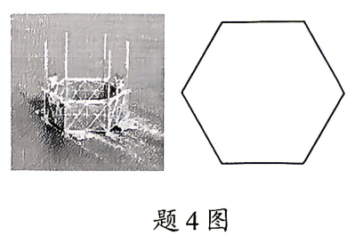
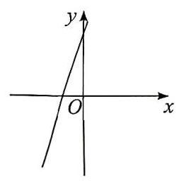
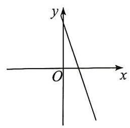
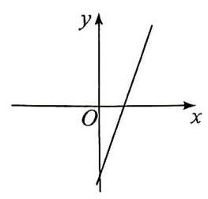
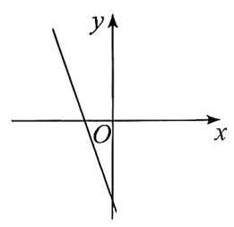
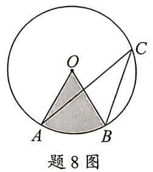
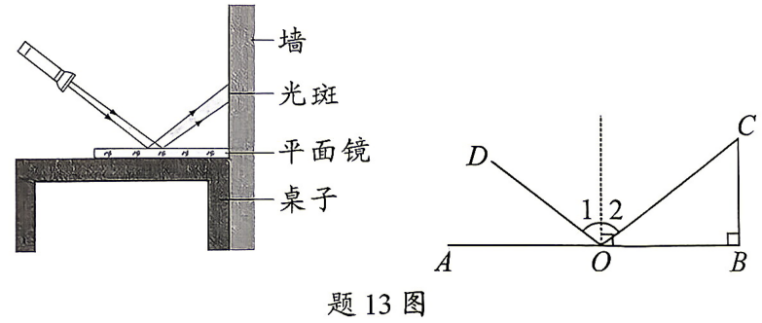
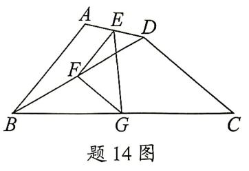

# 数学配图试卷测试（5题）

> 用于检查数学试卷 Word 配图、公式、题目展示是否正常。

---
## 学生作答区

## 一、选择题

### 1.【2026·广东中考·第4题｜基础】

某海洋牧场网箱采用了六边形流线型结构．如图，六边形的内角和为（题4图：六边形流线型网箱实物图）

A.$180°$  
B.$360°$  
C.$540°$  
D.$720°$  

答：__________

### 2.【2026·广东中考·第6题｜中等】

在平面直角坐标系中，一次函数 $y=3x+4$ 的图象可能是（题6图：A-D 四种斜率直线图象）

A.

B.

C.

D.

答：__________

### 3.【2026·广东中考·第8题｜中等】

如题8图，$\odot O$ 的半径为 $1$，点 $A$、$B$、$C$ 在 $\odot O$ 上，$\angle ACB=30°$．则图中阴影部分的面积为（题8图：圆 O 内 ABC 三点构成的扇形阴影）

A.$\dfrac{\pi}{6}$  
B.$\dfrac{\pi}{3}$  
C.$\dfrac{1}{6}$  
D.$\dfrac{1}{3}$  

答：__________

## 二、填空题

### 4.【2026·广东中考·第13题｜中等】

在桌上放一块平面镜，让手电筒的一束光斜射到平面镜上，在墙壁上就会出现一个明亮的光斑．如图，$AB=8$，$\angle 1=\angle 2$，$\tan\angle AOD=\dfrac{3}{4}$，则 $BC=$ ___（题13图：手电筒-平面镜-墙面光路）．

答：__________

### 5.【2026·广东中考·第14题｜较难】

如图，在四边形 $ABCD$ 中，$AB=CD=2$，$\angle BDC=110°$，$\angle ABD=20°$，点 $E$、$F$、$G$ 分别是 $AD$、$BD$、$BC$ 的中点，连接 $EF$、$FG$、$EG$，则 $EG=$ ___（题14图：四边形及中点连线）．

答：__________

---
# 答案与解析（教师/完成后使用）

### 1.【2026·广东中考·第4题】 答案：D

- **难度**：基础
- **知识点**：多边形内角和
- **考点**：$n$ 边形内角和公式 $(n-2)\times 180°$

**解析**：$n$ 边形内角和 $=(n-2)\times 180°$，六边形 $n=6$，内角和 $=(6-2)\times 180°=720°$。

### 2.【2026·广东中考·第6题】 答案：A

- **难度**：中等
- **知识点**：一次函数
- **考点**：一次函数 $y=kx+b$ 的图象（$k$ 决定斜率、$b$ 决定截距）

**解析**：$k=3>0$ 斜率为正；$b=4>0$ 截距为正，过一二三象限。

### 3.【2026·广东中考·第8题】 答案：A

- **难度**：中等
- **知识点**：圆与扇形
- **考点**：圆周角与圆心角关系；扇形面积公式

**解析**：$\angle ACB=30°$ 是圆周角，所对圆心角 $=2\times 30°=60°$，阴影扇形面积 $=\dfrac{60°}{360°}\times \pi\times 1^{2}=\dfrac{\pi}{6}$。

### 4.【2026·广东中考·第13题】 答案：$6$

- **难度**：中等
- **知识点**：锐角三角函数+反射定律
- **考点**：反射定律 $\angle 1=\angle 2$；锐角三角函数定义；勾股

**解析**：法线垂直平面镜，$\angle AOD=\angle 1+\angle 2=2\angle 1$，故 $\angle 1=\angle 2=\dfrac{\arctan 3/4}{2}$。在 Rt$\triangle ABD$ 中 $\tan\angle AOD=\dfrac{3}{4}=\dfrac{AB}{BD}$ 得 $BD$；再用相似/角度关系求 $BC$。最终 $BC=6$。

### 5.【2026·广东中考·第14题】 答案：$\sqrt{2}$

- **难度**：较难
- **知识点**：三角形中位线+勾股定理
- **考点**：中位线平行且等于底边一半；直角三角形求斜边

**解析**：$E$、$F$、$G$ 分别为 $AD$、$BD$、$BC$ 中点，由中位线 $EF=\dfrac{1}{2}AB=1$，$FG=\dfrac{1}{2}CD=1$，$\angle EFG=\angle BDC=110°$，$\angle DFG=\angle BDC-\angle BFG=110°-20°=90°$（$\angle BFG=\angle BDC-\angle CBD$ 推导）。Rt$\triangle EFG$ 中 $EG=\sqrt{EF^{2}+FG^{2}}=\sqrt{1+1}=\sqrt{2}$。
